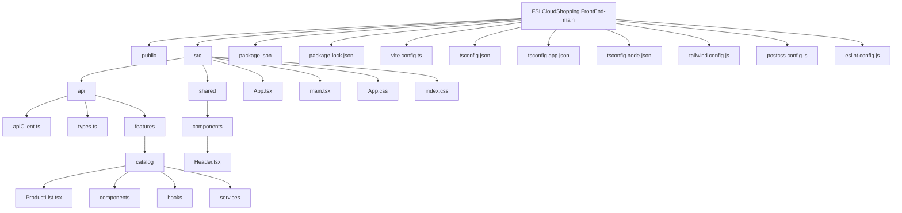

# FSI.CloudShopping.FrontEnd

## 📌 Visão Geral

Este projeto é o **front-end do Cloud Shopping**, desenvolvido em **React + TypeScript + Vite**, seguindo uma arquitetura modular baseada em **features**, com gerenciamento de estado assíncrono via **React Query**, chamadas HTTP via **Axios** e estilização com **Tailwind CSS**.

O objetivo principal da aplicação é fornecer uma interface moderna, performática e escalável para consumo de APIs de catálogo de produtos e serviços relacionados ao ecossistema Cloud Shopping.

---

## 🎯 Motivo e Objetivo do Projeto

Este front-end foi criado para:

- Servir como camada de apresentação para serviços backend do Cloud Shopping;
- Ser leve, rápido e otimizado via Vite;
- Permitir fácil manutenção e evolução através de separação por features;
- Facilitar integração com APIs REST;
- Padronizar componentes reutilizáveis;
- Garantir tipagem segura com TypeScript;
- Permitir fácil build, deploy e validação em ambientes locais e de produção.

---

## 🏗️ Estrutura do Projeto (Mermaid)

Abaixo está a estrutura principal do repositório representada em **Mermaid.js**, compatível com GitHub:



---

### 📂 Explicação das Principais Camadas

#### 🔹 `src/api/`
Responsável por toda comunicação com o backend:
- Centraliza configuração do Axios;
- Padroniza chamadas HTTP;
- Contém tipos globais;
- Organiza código por **feature**.

#### 🔹 `src/api/features/catalog/`
Implementa o fluxo de catálogo de produtos:
- Lista de produtos;
- Hooks customizados;
- Serviços de integração com API;
- Componentes específicos.

#### 🔹 `src/shared/`
Contém componentes reutilizáveis em toda aplicação, como:
- Header
- Layouts comuns (se houver futuras expansões)

---

## 🧩 Tecnologias Utilizadas

| Tecnologia | Finalidade |
|------------|------------|
| React 19 | Biblioteca principal de UI |
| TypeScript | Tipagem estática e segurança |
| Vite | Build e dev server ultrarrápido |
| Tailwind CSS | Estilização moderna |
| Axios | Chamadas HTTP |
| React Query | Gerenciamento de estado assíncrono |
| ESLint | Qualidade de código |

---

## 🚀 Como Executar o Projeto (Fluxo de Debug Local)

### **1️⃣ Clonar o repositório**
```bash
git clone https://github.com/rodrigofurlaneti/FSI.CloudShopping.FrontEnd
cd FSI.CloudShopping.FrontEnd-main
npm install
npm run build
npx serve -s dist -l 4173
```
### **2️⃣ Instalar dependências

Na raiz do projeto, execute:

npm install

### **3️⃣ Validar o código (build local)

Para verificar se o projeto compila corretamente:

npm run build


Isso executa:

tsc -b → valida TypeScript

vite build → gera versão otimizada em dist/

### **4️⃣ Rodar localmente em modo produção simulada

Após o build, execute:

npx serve -s dist -l 4173


A aplicação ficará disponível em:

http://localhost:4173

🐞 Fluxo de Desenvolvimento (Debug)

Para rodar em modo desenvolvimento (hot reload):

npm run dev


Acessar em:

http://localhost:5173


Vantagens:

Atualização automática ao salvar arquivos;

Logs detalhados no console;

Melhor experiência para desenvolvimento.

📦 Fluxo de Deploy
🔹 Build para Produção
npm run build


Isso gera a pasta:

/dist

🔹 Opções de Deploy

Você pode hospedar essa pasta em:

Nginx

Apache

Azure Static Web Apps

AWS S3 + CloudFront

Vercel

Netlify

Exemplo com Nginx:

Copiar conteúdo de dist/ para:

/var/www/cloudshopping


Configurar Nginx:

server {
    listen 80;
    server_name cloudshopping.com;

    root /var/www/cloudshopping;
    index index.html;

    location / {
        try_files $uri /index.html;
    }
}

✅ Boas Práticas Adotadas

Arquitetura por features

Separação clara entre UI e API

Uso de hooks personalizados

Tipagem forte com TypeScript

Gerenciamento eficiente de dados com React Query

Build confiável com Vite

📌 Próximos Passos (Sugestões)

Implementar autenticação JWT

Adicionar testes unitários (Vitest ou Jest)

Criar pipeline CI/CD (GitHub Actions)

Monitoramento de erros (Sentry)

Performance tracking (Web Vitals)

📄 Licença

Este projeto é de uso interno da organização FSI Cloud Shopping.


---


